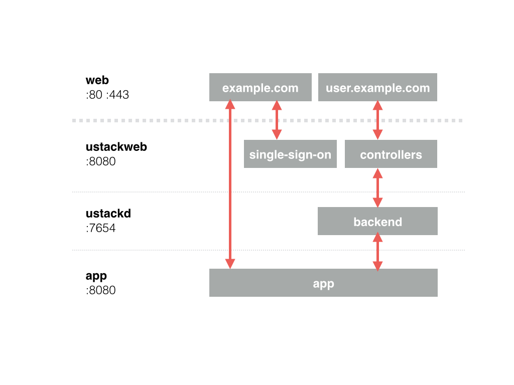

# ustackweb-nginx-example

## Docker Containers

## Environment Setup

Have a working [Docker](https://www.docker.com/) environment with [fig](http://fig.sh).

Install the following:
    
* [github.com/UserStack/ustackd](https://github.com/UserStack/ustackd)
* [github.com/UserStack/ustackweb](https://github.com/UserStack/ustackweb)

## Getting Started

Clone the repository

	git clone https://github.com/UserStack/ustackweb-nginx-example.git $GOPATH/../ustackweb-nginx-example
    cd $GOPATH/../ustackweb-nginx-example

Setup the project

    make prepare

Run the docker containers

    make run

## Configuration

Set the domain in the [fig.yml](fig.yml) as well as in the [github.com/UserStack/ustackweb](https://github.com/UserStack/ustackweb) project.

## FAQ

### Google Chrome Domain Cookie

To support the subdomain cookie read/write in Google Chrome browser the domain must have a valid TLD ending.

See [Chromium#56211](https://code.google.com/p/chromium/issues/detail?id=56211) and [Public Suffix](https://publicsuffix.org/learn/).

## License

See [LICENSE](LICENSE).
